# Cross Development - Verslag
Auteur: Caroline Van Gossum

Datum: 5 januari 2021

# Inhoud
1. [ Testcase ](#testcase)
2. [ QT ](#qt)
3. [ Ionic ](#ionic)
4. [ Electron ](#electron)
5. [ Samenvatting ](#samenvatting)

<a name="testcase"></a>
# Testcase
## Intro
Aangezien ik geen ervaring hebt met QT en C++, gebruik ik de testcase van de docent, de QtTimeTimer. Dit is een simpele timer applicatie, waar je de tijd kan instellen, de voor- en achtergrondkleur, en eventueel een geluid als de timer op nul staat.
 
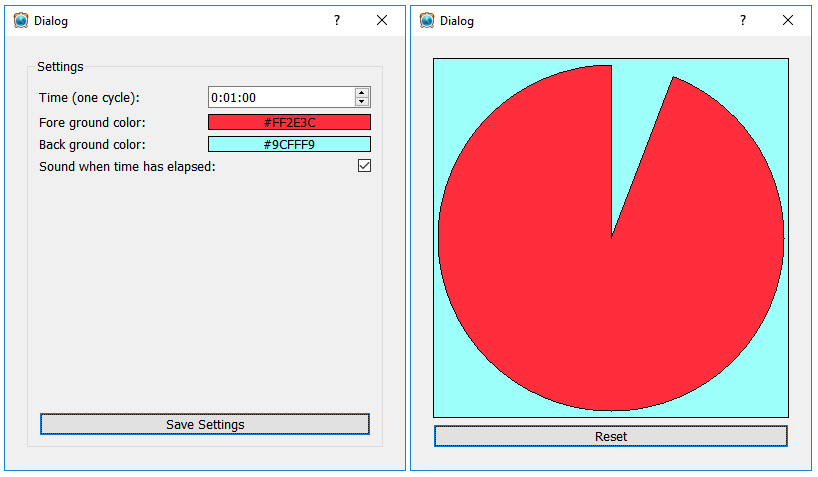

<a name="QT"></a>
# QT
## Intro

We gaan de testcase die we eerder gemaakt hebben met QT, cross compileren op een Linux machine, zodat we het kunnen runnen op een Windows PC. Ik heb gebruik gemaakt van een virtual machine waar Linux opstaat, omdat mijn PC zelf alleen Windows heeft. Het is aan te raden om voldoende schijfruimte te voorzien op je virtuele machine, minstens 50 GB, omdat MXE vrij veel plaats inneemt. 

## Gevolgde stappen
### 1. - Virtual Machine Linux aanmaken
Maak een nieuwe virtuele machine aan waar Linux opstaat. Mijn machine heeft ongeveer 6 GB RAM geheugen, en een dynamische schijfruimte van 80 GB. 

### 2. - MXE requirements en Download
Volg de stappen van deze tutorial (https://mxe.cc/#tutorial ) om MXE correct te installeren op de virtuele machine.

#### 2.1 Requirements
De virtual machine moet voldoen aan alle MXE's requirements, anders gaat het programma niet werken. We moeten verschillende zaken nog installeren, naargelang wat er reeds op uw systeem staat. Geef volgende code in om de requirements te installeren.

> apt-get install \
    autoconf \
    automake \
    autopoint \
    bash \
    bison \
    bzip2 \
    flex \
    g++ \
    g++-multilib \
    gettext \
    git \
    gperf \
    intltool \
    libc6-dev-i386 \
    libgdk-pixbuf2.0-dev \
    libltdl-dev \
    libssl-dev \
    libtool-bin \
    libxml-parser-perl \
    lzip \
    make \
    openssl \
    p7zip-full \
    patch \
    perl \
    python \
    ruby \
    sed \
    unzip \
    wget \
    xz-utilscode

    Error: unable to acquire the dpkg frontend lock...
    Betekenis: het update programma van ubuntu is nog aan het updaten.
    Oplossing: wacht tot alle updates klaar zijn, en voer het commando opnieuw uit.

Verder installeren we python-mako via volgend commando
> sudo apt-get install -y python-mako

#### 2.1 Download
Download de huidige versie van MXE via github.
>git clone https://github.com/mxe/mxe.git

De stap 'System Wide Installation' van de tutorial slaan we over, aangezien we MXE in onze home directory willen installeren.

### 3. Build MXE
Nu we MXE gedownload hebben, gaan we deze builden. Geef volgend commando in. Het uitvoeren van dit commando kan een tijdje duren, bij mij heeft het een 40tal minuutjes geduurd.
> make cc

    Error: No rule to make target 'cc'
    Betekenis: We zitten niet in de juiste map (mxe)
    Oplossing: Ga in de map mxe, en voer het commando opnieuw uit.

Daarna voer je het volgende commando uit om QT te installeren, wat bij mij 2 uur in beslag nam.
> make qtbase


### 4. Environment Variable aanpassen
Verander de PATH variabele zodat Linux weet waar MXE geïnstalleerd is.
> export PATH=/home/caroline/mxe/usr/bin:$PATH


### 5. Cross Compileren (QT)
In deze stap van de tutorial gaan we de compilatie uitvoeren. Zorg ervoor dat bij je VM settings 'shared clipboard' en 'drag n drop' op bidirectional staan, zodat je makkelijk bestanden vanuit je Windows PC naar je Linux machine kan kopiëren. 

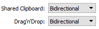

Kopieer eerst je testcase die je wil cross-compileren naar je Linux machine. 

    Probleem: De map van de testcase is gekopieerd, maar de inhoud van de map niet. 
    Oplossing: Selecteer de inhoud en sleep deze naar Linux.
    
Ga naar de map waar je testcase instaat, en voer het make commando uit
> /home/caroline/mxe/usr/i686-w64-mingw32.static/qt5/bin/qmake make
    
    Error: img 'clock' is not found in /res...
    Probleem: Bij het kopieren van de testcase is de inhoud van de /res folder niet mee gekopieerd. 
    Oplossing: Selecteer de inhoud en sleep deze naar Linux. Voer het commando opnieuw uit.

De compilatie is nu voltooid.


### 6. Shared folder aanmaken
We maken nu een gedeelde map aan, zodat we vanuit onze Windows PC onze applicatie kunnen raadplegen.

Pas eerst de settings van je VM aan. Klik bovenaan op Devices -> Insert Guest Additions CD Image -> Run.

Daarna gaan we onze shared folder settings aanpassen. Klik op Devices -> Shared Folders -> Shared Folders Settings.
Maak aan nieuwe folder aan. Vul volgende zaken in:
* Folder path: path op Windows
* Folder name: naam 'app' op Windows
* Auto mount aanvinken
* OK

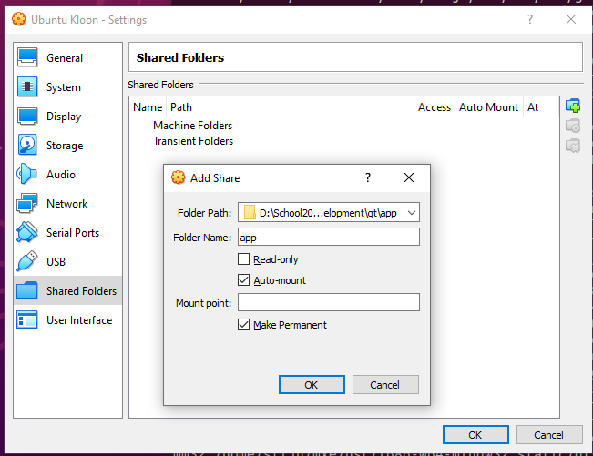

Open nu de terminal in Linux, en maak een nieuwe map aan in Linux
>mkdir app-windows

Link de map met de map die je hebt gemaakt op Windows.
>sudo mount -t vboxsf app app-windows

* app: map op Windows
* app-windows: map op Linux

De shared folder is nu aangemaakt, dit kan je ook zien bij de instellingen van je VM.

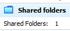


### 7. Run je programma op Windows
Ga op je Windows PC naar de locatie waar je de gedeelde map hebt aangemaakt. Nu zie je dat de inhoud van de map overeenkomt met de inhoud van de Linux map. Klik op 
* app (naam van de map)
* QtTimeTimer (naam van de applicatie)
* Release
* TestCase.exe (executable)

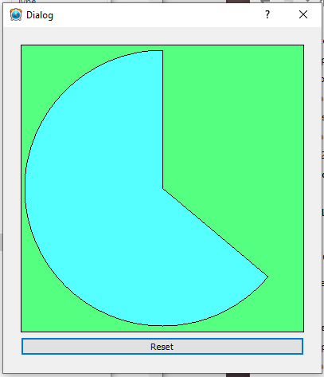

Je programma runt nu op je Windows PC, het cross compileren is geslaagd!


## Eventuele aanpassingen aan het concept
Wanneer je werkt met een Linux of Unix systeem, is het belangrijk om te weten dat Unix case-sensitive is. Dit betekent dat een karakter in hoofdletters of kleine letters wel degelijk anders wordt geïnterpreteerd. Bij het typen van commando's moet je hier op letten, maar ook in je testcase. QT op Windows is namelijk niet hoofdlettergevoelig, maar QT op Unix wel. Zorg dus voor een consistent gebruik van hoofdletters en kleine letters.

## Link met theorieles
In de les hebben we verschillende build systemen bekeken, zoals GNU Autotools, CMake, PreMake en SCONS. Omdat we in dit project met QT werken, maken we gebruik van de qmake tool om ons project te builden. qmake genereert automatisch de Makefiles, zodat we alleen nog het make commando moeten uitvoeren om ons project te builden.

## Conclusie
De setup van MXE is op zich vrij simpel door de tutorial die je kan volgen, maar het neemt wel wat tijd in beslag. Het internet op school was niet sterk genoeg om alles binnen een realistische tijdspanne te downloaden, waardoor ik alles thuis heb moeten downloaden, en enkele uren verloren heb. En als je kleine zaken vergeet aan te passen, en je dan een commando laat runnen van een paar uur, is het frustrerend om uiteindelijk een foutmelding te krijgen. Hier heb ik wel wat tijd aan verloren, waardoor ik het minder aangenaam vond om hiermee te werken. Er was wel voldoende documentatie terug te vinden op het internet, alsook eventuele foutmeldingen.

## Screenshots eindresultaat


## Extra's 
### Gebruikte sites:
* https://mxe.cc/#tutorial
* https://mxe.cc/#requirements
* https://itsfoss.com/could-not-get-lock-error/
* https://github.com/google/or-tools/issues/380
* https://doc.qt.io/qt-5/qmake-manual.html


<a name="ionic"></a>
# Ionic
## Intro
Als we Ionic gebruiken om te cross-compileren, moeten we eerst de testcase omzetten naar een webtaal. Aangezien ik voor QT de testapplicatie van de docent mocht gebruiken, herschrijf ik nu deze applicatie in Angular. Angular (dat gebaseerd is op typescript) heeft een heel andere syntax dan C. Daarom kunnen we jammer genoeg weinig code hergebruiken. 

## Gevolgde stappen
### 1. Applicatie herschrijven naar Angular
Eerst gaan we Ionic installeren op onze computer. Typ volgend commando in:
> npm install -g ionic

Daarna gaan we een nieuw Ionic project aanmaken. Kies eerst je framework, wij kiezen hier voor Angular. Daarna kan je een starter template kiezen.

> ionic start projectTimer

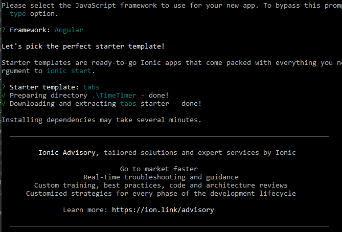

Kies een editor om je project mee te openen, en probeer het project te runnen. Zorg ervoor dat je in de juiste map zit.

> ionic serve

Nu herschrijven we alle code in Typescript, zodat we een webapplicatie krijgen. Aan de hand van de Ionic documentatie (onderdeel Angular) kan je heel wat informatie terugvinden over de routing, de modules,... En via de UI Components documentatie vind je makkelijk terug welke ionic tags je best gebruikt. 

Handige documentatie over het Ionic framework:
* https://ionicframework.com/docs/angular/navigation
* https://ionicframework.com/docs/components 

Via de localhost kunnen we ons project bekijken.

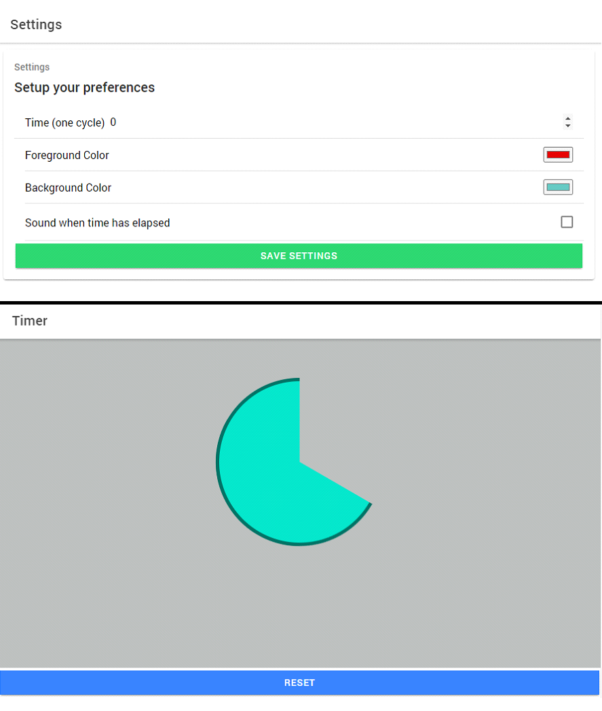


### 2. Capacitor
Nu gaan we over de stappen die nodig zijn om de Ionic App te testen in een Android Emulator. We maken gebruik van Capacitor, dat gereleased is in april 2020. Capacitor is een native runtime voor hybride applicaties. Een hybride app is een webapp die we via een wrapper op andere platformen kunnen gebruiken, zoals Android of iOS. Wij gebruiken dus Capacitor als 'wrapper', aangezien dit ook door Ionic ontwikkeld is.

We gaan de applicatie runnen op een Android smartphone. Zorg ervoor dat Android Studio geïnstalleerd is op je computer. Zo hebben we toegang tot het build systeem Gradle, de juiste SDK en een geschikt Android Virtual Device.

### 3. Plugins toevoegen 
Capacitor maakt gebruik van plugins zodat de applicatie toegang heeft tot de native API. Zo kunnen we toegang krijgen tot het systeem, de camera, storage,... Capacitor heeft zelf een hele lijst van officiële plugins, die kan je terugvinden via volgende link: https://capacitorjs.com/docs/apis . Je kan ook zelf een custom plugin schrijven.

Voor de Timer Applicatie heb ik gebruik gemaakt van de plugin Modals, om een alert te tonen wanneer de timer is afgelopen.
Om de kleuren van de cirkel op te slaan, gebruik ik de plugin Storage. Zo blijven de gekozen kleuren behouden, ook na het afsluiten van de applicatie.


### 4. Plugins testen
Onze applicatie heeft nu alle nodige functionaliteiten, het is tijd om deze te testen in een emulator. Volg hiervoor volgende stappen:

#### 4.1 Installeer de dependancy
> npm install -g @ionic/cli native-run cordova-res

#### 4.2 Voeg een @capacitor map toe
Kijk na of je een @capacitor map hebt staan in je node_modules map. Indien dit niet het geval is, voeg deze dan toe via volgend commando:
> ionic integrations enable capacitor

#### 4.3 Build de applicatie
> ionic build

#### 4.4 Start de live reload sessie op
> ionic cap run android -l --external

Selecteer een IP adres in de lijst. Android wordt nu opgestart, dit kan een vijftal minuutjes duren.

    Error: This version of Android Studio cannot open this project, please retry with Android Studio 3.6 or newer
    Betekenis: Update je Android Studio
    Oplossing: Controleer de updates in Android Studio, en voer deze uit. Build daarna opnieuw de applicatie.

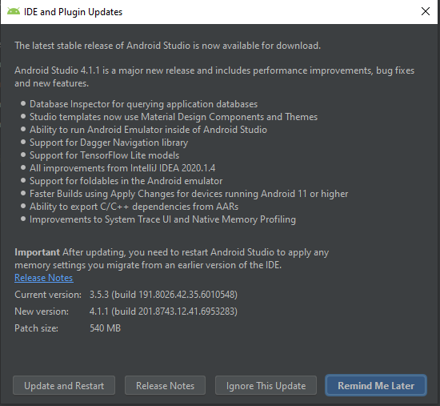

#### 4.5 Bewerk de Androind Manifest file
De development server waar we onze app op runnen, gebruikt geen https maar http. Hierdoor wordt die door Android (vanaf API level 28 of hoger) als onveilig gezien, en moeten we dit specifiek toelaten in het manifest. Pas volgende code aan:
> <application android:usesCleartextTraffic="true"

Nu kan je de applicatie runnen op een Android emulator, en alle functionaliteiten testen.

    Error: io.ionic.starter E/Capacitor: Unable to read file at path public/plugins.
    Betekenis: Het path naar public/plugins kan niet gelezen worden.
    Oplossing: Download en update API 27.

Probeer de applicatie opnieuw te runnen.

    Error: Installation did not succeed. The application could not be installed. 
    Betekenis: De installatie is niet gelukt.
    Oplossing: Installeer en update volgende SDK Tools: Android SDK Build-Tools, Android Emulator, Android SDK Platform-Tools en Android SDK Tools. 

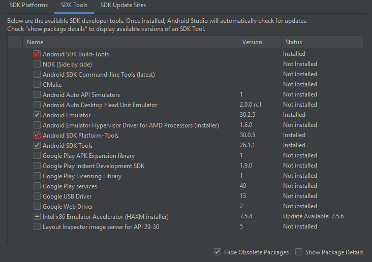

Run de applicatie opnieuw, deze keer zou het moeten werken.

### 5. Deployment
Nu we de applicatie getest hebben, kunnen we deze gaan deployen. Open opnieuw de manifest file in Android Studio, en zet usesCleartextTraffic op false.
> <application android:usesCleartextTraffic="false"

Build daarna opnieuw je ionic applicatie.
> ionic build

Wanneer de webcode gebuild is, moeten we deze kopiëren naar een native project. Elke keer als je iets in je code hebt veranderd en hebt gebuild, moet je dit commando uitvoeren.
> ionic cap copy

Open daarna Android Studio via volgend commando:
> ionic cap run android

Nu kunnen we onze applicatie runnen, en hebben we een hybride app ontwikkeld.


## Veranderingen in de code
Aangezien we de code van C naar Angular (Typescript) omzetten, kunnen we weinig code hergebruiken. De belangrijkste verandering is het tekenen van de cirkel. Bij het tekenen van de cirkel, waar we visueel de tijd zien passeren, gebruikten we in C het paintEvent. Daar werkten we met coördinaten en functies zoals setBrush en drawRect. In Angular heb ik besloten om de cirkel te tekenen via css en css animaties. Aangezien ik al wat ervaring heb met css animaties, was dit voor mij de meest logische keuze. Ik heb 3 halve cirkels gebruikt, via de visibility property de cirkels (on)zichtbaar gemaakt, en ze dan geanimeerd met keyframes. Het eindresultaat is uiteindelijk hetzelfde als in C.

## Link met theorieles
In de les hebben we Capacitor besproken, dit ga ik dan ook gebruiken in het project.

## Conclusie
Ionic vind ik zeer aangenaam om mee te werken, aangezien ik vertrouwd ben met webtalen. De drempel om hiermee een app te maken ligt hierdoor lager dan bij QT. Er is ook voldoende documentatie over Ionic, en ondanks dat Capacitor nog redelijk nieuw is, is er ook hier voldoende documentatie over terug te vinden. Het builden van de applicatie ging over het algemeen vlot, ik had wel wat problemen met Android Studio, en daarom duurde het langer, maar met Ionic zelf had ik weinig problemen.

## Screenshots eindresultaat


## Extra's 
### Gebruikte sites:
* https://ionicframework.com/docs/angular/navigation
* https://ionicframework.com/docs/components
* https://www.w3schools.com/css/css3_animations.asp
* https://developer.android.com/studio/intro/update
* https://capacitorjs.com/docs/apis 


<a name="electron"></a>
# Electron
## Intro
In dit hoofdstuk gaan we Electron gebruiken om onze testcase te cross-compileren. Electron is een framework waarmee we native desktop kunnen bouwen, via webtechnologie. De app kan daarna worden gepackaged zodat ze ook op Mac, Windows of Linux kunnen draaien. We kunnen een groot stuk code van Ionic hergebruiken, maar moeten wel opletten met enkele security issues.

## Gevolgde stappen
### 1. Maak een nieuw Electron project
We maken een nieuw project aan via volgend commando. Dit kan een vijftal minuutjes duren.
> ionic start ElectronTimer --type=angular --capacitor

Daarna gaan we de benodigde pakketten installeren.
> npm install ngx-electron electron

    Error: Refusing to install package with name "ElectronTimer" under a package also called "ElectronTimer". Did you name your project the same as the dependency you're installing?
    Betekenis: Er bestaat reeds een dependency ElectronTimer, de installatie kan niet voltooid worden.
    Oplossing: Verander de naam van je project naar "Testcase".

> npm install electron-packager --save-dev

Ga in de map ElectronTimer en controleer of de bestaande packages nog up-to-date zijn en of er vulnerabilities gevonden zijn. (Optioneel)
> npm audit fix

Vervolgens gaan we de app builden, zodat het platform kan worden toegevoegd aan de capacitor.
> ng run app:build --base-href=./

Aangezien we nu een nieuw project gaan builden waar weinig instaat, neemt dit weinig tijd in beslag.

Nu moeten we nog het electron platform toevoegen aan de capacitor.
> ionic capacitor add electron

Daarna kunnen we onze applicatie starten als een electron applicatie via de capacitor, via volgend commando:
> npx cap open electron

Capacitor opent nu het project dat we hebben aangemaakt. Nu we weten dat dit werkt, kunnen we onze code van de Timer applicatie hier herschrijven.

Voor we echter onze applicatie gaan aanpassen, gaan we er eerst voor zorgen dat de live reload werkt, zodat als we aanpassingen maken, onze build ook wordt aangepast. Na elke aanpassing moeten we volgend commando uitvoeren:

> ng run app:build --base-href=./ && npx cap copy && npx cap open electron

Aangezien het nogal omslachtig is om elke keer dit commando in te typen, voegen we dit toe als een script aan de package.json file.

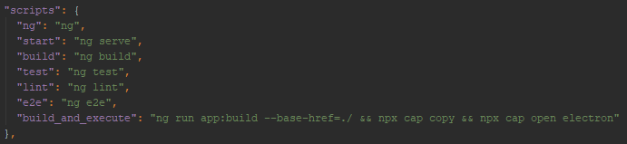

Nu moeten we enkel nog het script uitvoeren na de aanpassingen:
> npm run build_and_execute

### 2. Code herschrijven voor Electron
De code van Ionic heb ik kunnen overnemen voor Electron, hier heb ik dus weinig werk mee. Nu kan ik het project opnieuw builden en executen.


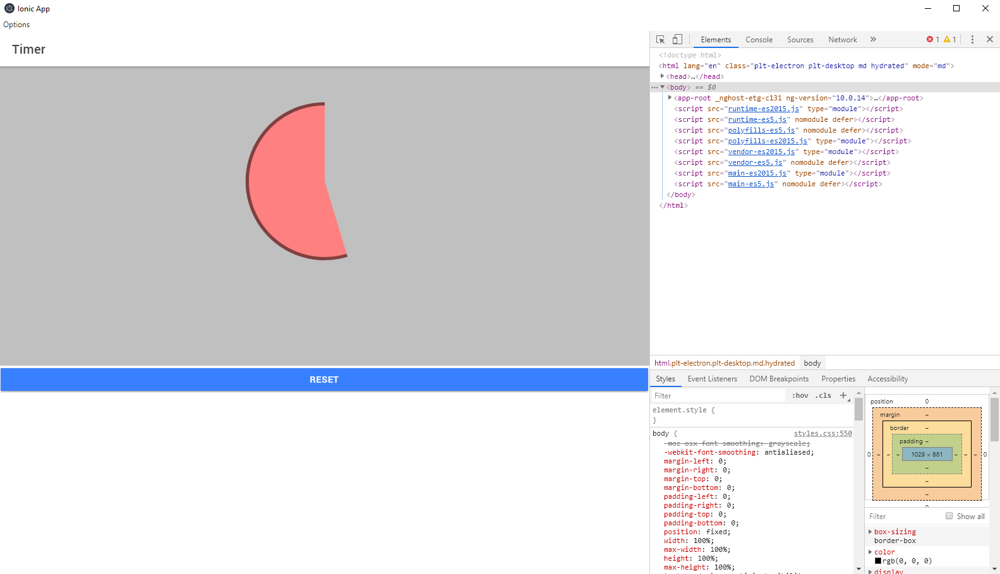

#### IPC communicatie
Een Electron project bestaat uit 2 types processen: het main proces en het renderer proces. Om te communiceren tussen deze twee processen, gebruiken we IPC (InterProcessCommunicatie) om boodschappen te sturen.

Via het menu 'opties' kan de user zelf een eigen sound kiezen, die afgespeeld wordt als de timer klaar is. Om dit te implementeren in het project, maken we gebruik van een Dialog, om de gekozen sound te tonen aan de user. Normaal zou dit zonder problemen moeten werken, maar ik had hier wel wat problemen mee.


    Error: The target entry-point ngx-electron has missing dependencies: @angular/core
    Betekenis: Er is een dependency niet geïnstalleerd bij de installatie van ngx-electron
    Oplossing: Map 'node_modules' leegmaken en opnieuw 'npm install' uitvoeren

    Error: The target entry-point ngx-electron has missing dependencies: @angular/core
    Betekenis: Het verwijderen van de node_modules heeft dit probleem niet opgelost.
    Oplossing: Op stackoverflow error opzoeken, maar er is geen duidelijke oplossing. (https://github.com/angular/angular-cli/issues/10681)    
    Oplossing: package.json files vergelijken met andere student, om te kijken of de versies hetzelfde zijn.
    Oplossing: de versie van Capacitor is verschillend, ik pas mijn versie van 2.4.5 aan naar 2.4.3
    
    Error: The target entry-point ngx-electron has missing dependencies: @angular/core
    Betekenis: Het aanpassen van de Capacitor versie heeft dit probleem niet opgelost
    Oplossing: Ik besluit om opnieuw te beginnen, ik kopieer mijn project van Ionic, en volg dan de stappen om de nodige packages te installeren en het project aan te passen naar Electron. Nu is er geen error meer, maar waarom het eerder foutliep weet ik niet.

Pas in de index.js file het submenu aan, zodat de user uit verschillende alarmopties kan kiezen. In de settings component wordt gecommuniceerd met het main process, en het renderer proces stuurt de juiste sound file door naar de Circle component. Daar wordt het geluid dan afgespeeld.

#### NodeJS API call
Voor de NodeJS API call maak ik gebruik van de Notification plugin, zodat er op het systeem van de user (in mijn geval Windows) een notificatie tevoorschijn komt wanneer de user voor een ander alarmtoon kiest. Dit vervangt de Dialog functie die ik gebruikte in het renderer process. In het main proces (index.js) schrijven we de functie showNotification, met een titel en beschrijving. Bij het menu gebruiken we dan de functie om naargelang de gekozen sound de juiste notificatie te tonen.

> Tip: Kijk na of notificaties toegestaan zijn op je Windows en of 'Focus Assist' uitstaat, anders worden de notificaties niet getoond.

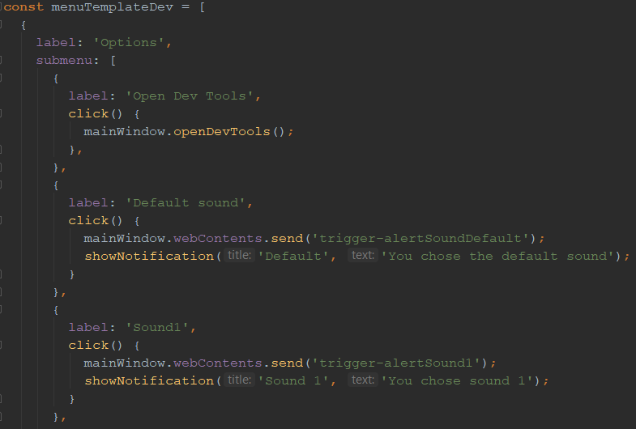

### 6. Electron Deployment
Om ons Electron project te deployen, maken we gebruik van de tool electron-forge.

In het projecten hebben we 2 package.json files, 1 in de root van het project, en 1 in de electron folder. De file /electron/package.json gebruiken we voor het deployen, dus het is belangrijk om de volgende commando's op deze locatie uit te voeren.

Eerst gaan we electron-forge toevoegen aan ons project, dit kan enkele minuutjes duren. Dit doen we via volgend commando
> npx @electron-forge/cli import

Dit commando voegt nieuwe dependancy's toe aan de package.json file, installeert deze dependancy's en voegt de out map toe, dit is de map waar de output bestanden gegenereerd worden.

Daarna gaan we het veld author toevoegen in de package.json file.

```json
"author": "Caroline Van Gossum",
```

Nu kunnen we het project builden.
> npm run make

Het builden is gelukt! Open het project openen via /electron/out/projectTimer-win32-x64/projectTimer.exe


## Security
In dit hoofdstuk bespreek ik enkele belangrijke security regels bij het gebruik van Electron, en pas ik ze toe op het project.

### 1. Only load secure content
De app mag alleen veilige content laden, dus gebruiken we https in plaats van http. Https zorgt er onder andere voor dat de externe server geverifieerd wordt, zodat de app verbinding maakt met de juiste host en geen imitator.

In mijn project heb ik dit niet moeten toepassen, aangezien ik geen externe content inlaad.

### 2. Disable the Node.js integration in all renderers that display remote content
Belangrijk is om de remote content minder rechten geven, zodat we XSS (cross-site-scripting) aanvallen voorkomen. Dit kan gevaarlijk zijn omdat de remote content dan uit het renderer proces kan komen, en malafide code kan uitvoeren op de computer van de gebruiker.

Aangezien ik in dit project geen remote content gebruik, moet ik dit hier niet toepassen.

### 3. Enable context isolation in all renderers that display remote content
Door de context isolatie in te schakelen, wordt de code van scripts en Electron API's in een bepaalde JavaScript context gedraaid. Zo kunnen eventueel malafide scripts in het renderer proces hier geen aanpassingen aan maken.

Aangezien ik in dit project geen remote content gebruik, moet ik dit hier niet toepassen.

### 4. Use ses.setPermissionRequestHandler() in all sessions that load remote content
Eem permissie request krijg je regelmatig via Chrome, bijvoorbeeld als je Discord in de browser opent, gaat hij toegang vragen tot je camera en microfoon. Electron staat default alle permissies request toe, tenzij de developer dit manueel uitzet. Het wordt dan ook sterk aangeraden om de requests uit te schakelen. Dit kan je doen door een handler te ontwikkelen.

Ik heb geen sessions gebruikt in mijn project, dus kan dit ook niet toepassen.

### 5. Do not disable webSecurity
Bij het maken van een nieuwe BrowserWindow is Websecurity default ingeschakdeld door Electron. Als je dit echter uitschakelt, zet Electron de allowRunningInsecureCoontent op true, waardoor onveilige code van verschillende domains uitgevoerd kan worden.

In dit project heb ik dus volgende regel code toegevoegd bij het maken van mijn BrowserWindow. Dit is echter niet verplicht, omdat default webSecurity al op true staat.

```js
mainWindow = new BrowserWindow({
    webPreferences: {
      webSecurity: true
    }
});
```


### 6. Define a Content-Security-Policy and use restrictive rules (i.e. script-src 'self')
De Content Security Policy is een extra beschermingslaag tegen Cross-Site-Scripting attacks en data injectie attacks. Deze beperkt het laden van scripts die de user zelf kan ingeven. Zo mogen bijvoorbeeld scripts van evil.attacker.com niet uitgevoerd worden.

Ik heb geen sessions gebruikt in mijn project, dus kan dit ook niet toepassen.

### 7. Do not set allowRunningInsecureContent to true
Als AllowRunningInsecureContent op false staat, mogen websites die geladen worden via https geen scripts, CSS of plugins uit onveilige bronnen uitvoeren. Default staat dit dan ook op false.

Bij het maken van de BrowserWindow heb ik volgende regel code toegevoegd, maar zoals eerder vermeldt, kan dit ook weggelaten worden, omdat Electron dit al default op false zet.

```js
mainWindow = new BrowserWindow({
    webPreferences: {
      allowRunningInsecureContent: false
    }
});
```

### 8. Do not enable experimental features
De experimentele features in Electron zijn default uitgeschakeld, omdat deze features experimenteel zijn en de impact hiervan nog niet overal getest is. Daarom wordt het aangeraden dat als je deze features niet nodig hebt, je ze ook beter uitgeschakeld laat staan.

Volgende regel code voegen we toe bij het maken van de BrowserWindow, en aangezien Electron deze default al op false zet, mag je deze ook weglaten.

```js
mainWindow = new BrowserWindow({
    webPreferences: {
      experimentalFeatures: false
    }
});
```

### 9. Do not use enableBlinkFeatures
Blink is de rendering machine die achter Chromium zit. Default zijn ook deze features uitgeschakeld, omdat je die als developer meestal niet nodig hebt. Indien je wel een feature hiervan wil gebruiken, kan je deze nog inschakelen.
In dit project heb ik deze features niet nodig gehad.

### 10. webview: Do not use allowpopups
Via de webview kan je een nieuwe window creëren en openen. Als je project deze feature echter niet nodig heeft, moet je hem ook niet gebruiken, aangezien dit alleen maar extra security risico's geeft.

In dit project heb ik geen gebruik gemaakt van webview.

### 11. webview: Verify options and params
Een webview heeft een eigen onafhankelijk renderer proces met eigen webPreferences. Het is belangrijk om als je een webview gebruikt, de opties en parameters na te kijken. De webview leeft in de DOM, en kan aangemaakt worden om onveilige scripts te runnen op je website.

In dit project heb ik geen gebruik gemaakt van webview.

### 12. Disable or limit navigation
Indien je applicatie geen navigatie nodig heeft, is het beter om de navigatie uit te schakelen of te beperken. Navigatie wordt namelijk vaak gebruikt om aanvallen uit te voeren, als je applicatie immers van de huidige pagine weg navigeert, kan hij gedwongen worden om andere onveilige websites te openen op het internet.

Ik heb in mijn project gebruik gemaakt van 3 routes:
* ' ' -> settings
* 'home' -> home
* '**' -> redirect naar settings

### 13. Disable or limit creation of new windows
Beperk ook het aanmaken van nieuwe of extra windows in je applicatie. WebContents worden namelijk voor gebruikt om aanvallen uit te voeren, zo kunnen ze nieuwe Windows aanmaken die meer priviliges hebben, en zo het main process binnendringen.

In mijn project wordt er slechts 1 browserwindow aangemaakt in de index.js file.

### 14. Do not use openExternal with untrusted content
De openExternal functie van de shell kan URI's openen, maar een verkeerd gebruik hiervan kan de user's host hiervan in gevaar brengen. Gebruik deze functie dus niet met onveilige of niet-vertrouwde URI's.

Aangezien ik geen gebruik heb gemaakt van de shell, is deze regel niet van toepassing.

### 15. Disable the remote module
Als je remote module niet gebruikt, is het belangrijk om hem uit te schakelen. Anders hebben de renderer processen toegang to de API's die normaal alleen beschikbaar zijn in het main process. Malifide code kan zo uit de sandbox gaan en via het main process (die meer privileges heeft) toegang krijgen tot de systeem resources.

In het project heb ik volgende regel toegevoegd bij het maken van de BrowserWindow.

```js
mainWindow = new BrowserWindow({
    webPreferences: {      
      enableRemoteModule: false
    }
});
```

### 16. Filter the remote module
Indien je de remote module toch nodig hebt, kan je deze niet uitschakelen. De globals, Node en Electron modules die toegankelijk zijn via de remote module, kan je dan best filteren.

### 17. Use a current version of Electron
Tot slot is het aangeraden om een recente versie van Electron te gebruiken. Een applicatie met een oudere versie is namelijk een makkelijker target voor hackers. De security issues en exploits van de vorige versies van Chromium en Node.js zijn ook weggewerkt in de recente versies.


## Eventuele aanpassingen aan het concept
Er zijn geen aanpassingen aan het concept, de code van Ionic heb ik volledig kunnen hergebruiken, en dan extra zaken zoals IPC en NodeJS API call toegevoegd. De titel in de html file heb ik uiteraard wel veranderd van Ionic naar Electron.

## Link met theorieles
In het hoofdstuk 'Security' worden de veiligheidregels gezien in de les toegepast op het project.

## Screenshots eindresultaat


## Extra's 
### Gebruikte sites:
* https://ionicframework.com/docs/cli 
* https://devdactic.com/ionic-desktop-electron/
* https://www.electronjs.org/docs/tutorial/security
* https://github.com/angular/angular-cli/issues/10681 
* https://www.electronjs.org/docs/api
* https://www.electronjs.org/docs/tutorial/notifications

<a name="samenvatting"></a>
# Samenvatting
## Vergelijking

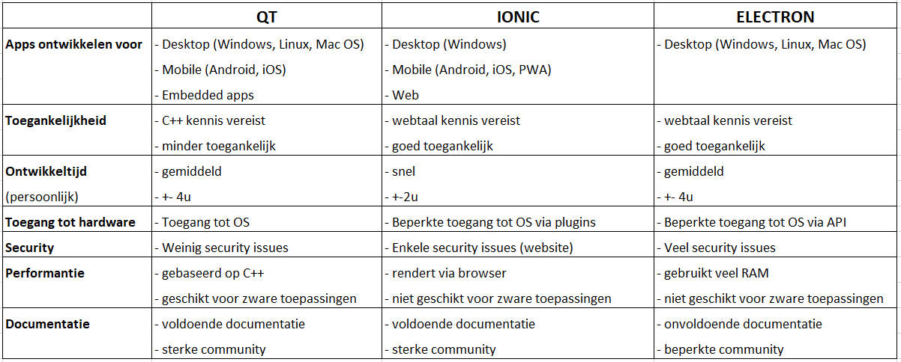

### Toegankelijkheid
Qua toegankelijkheid vind ik Ionic en Electron toegankelijker dan QT. Er zijn immers meer programmeurs die webtalen kennen, dan een native taal zoals C++.

### Ontwikkeltijd
De ontwikkeltijd bij Ionic was bij mij het kleinst, dit komt omdat ik veel ervaring heb met webtalen en daardoor het project snel kon herschrijven. Het builden zelf duurde ongeveer 3 minuutjes, en de deployment 5 minuten. Ik had wel enkele problemen met Android Studio, maar aangezien deze als een emulator dient heb ik de besteden tijd hieraan niet meegeteld.

Bij het ontwikkelen van het project in QT heb ik veel tijd verloren bij het builden van MXE (40 minuten) en het make commando om QT te installeren (120 minuten).

Het project in Electron ontwikkelen duurde ook langer dan verwacht. Dit komt omdat bij het maken van het project niet alle dependencies geïnstalleerd waren, en ik dit pas later door had, waardoor ik opnieuw ben moeten beginnen. Ik denk wel dat met de opgedane ervaring de ontwikkeltijd van een volgend Electron project sterk zal dalen.

### Toegang tot hardware
Bij het gebruik van C++ en QT heb je automatisch toegang tot de native functies van de hardware, terwijl we bij Ionic en Electron hiervoor extra plugins moeten gebruiken. Een nadeel van die plugins is dat die vendor-afhankelijk zijn, als er dus een nieuwe smartphone uitkomt met nieuwe native functionaliteiten, zijn er nog geen plugins voor gemaakt, en moeten we hiervoor nog een tijdje wachten eer we deze kunnen gebruiken.


### Security
In de lessen hebben we vooral bij Electron stilgestaan bij de security. Aangezien Electron buiten de sandbox gaat van de Chromium Architecture, zijn er veel security problemen. Bij Ionic zijn er enkele security problemen, zoals bijvoorbeeld bij de user input, omdat er gebruik wordt gemaakt van webtalen. Het is dus belangrijk om de user input altijd te controleren zodat er geen Cross Site Scripting attack kan plaatsvinden.

### Performantie
Bij het maken van een applicatie met C++ en QT kan je rekenen op een goede performantie. Dit is dan ook geschikt voor zware toepassingen. Bij Ionic vormt dit echter een probleem, aangezien hij rendert via de browser is dit platform niet geschikt voor zwaardere toepassingen. Over de performantie van Electron is iets minder bekend, maar aangezien hij ook via het web werkt, denk ik dat de performantie lager ligt dan bij QT.

### Documentatie
Bij zowel QT en Ionic was er voldoende documentatie online te vinden. Ze hebben ook een sterk uitgebouwde community, waardoor je veel foutmeldingen online kan terugvinden. Dit was helaas niet het geval bij Electron, omdat het nog in zijn kinderschoenen staat. Hopelijk is er in de toekomst meer documentatie hiervoor beschikbaar.

## Conclusie
In dit project hebben we 3 manieren uitgeprobeerd om te cross-compileren, en mijn persoonlijke keuze is om te werken met Ionic. Ik ben zelf vertrouwd met webtalen, en vind het altijd moeilijk om een goede User Interface te ontwerpen, dus dan komen de ingebouwde UI components goed van pas. Bij Electron vind ik de security problemen en het gebrek aan documentatie een groot nadeel. Een voordeel van QT vind ik dat je de hardware direct kan aanspreken, zonder gebruik te moeten maken van plugins. Ik denk wel dat Hybride apps de toekomst zijn, aangezien de developerkost veel lager ligt, en je het kan ontwikkelen voor meerdere platformen.
