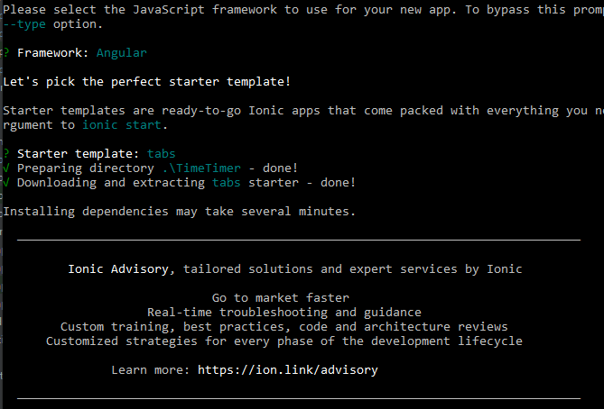
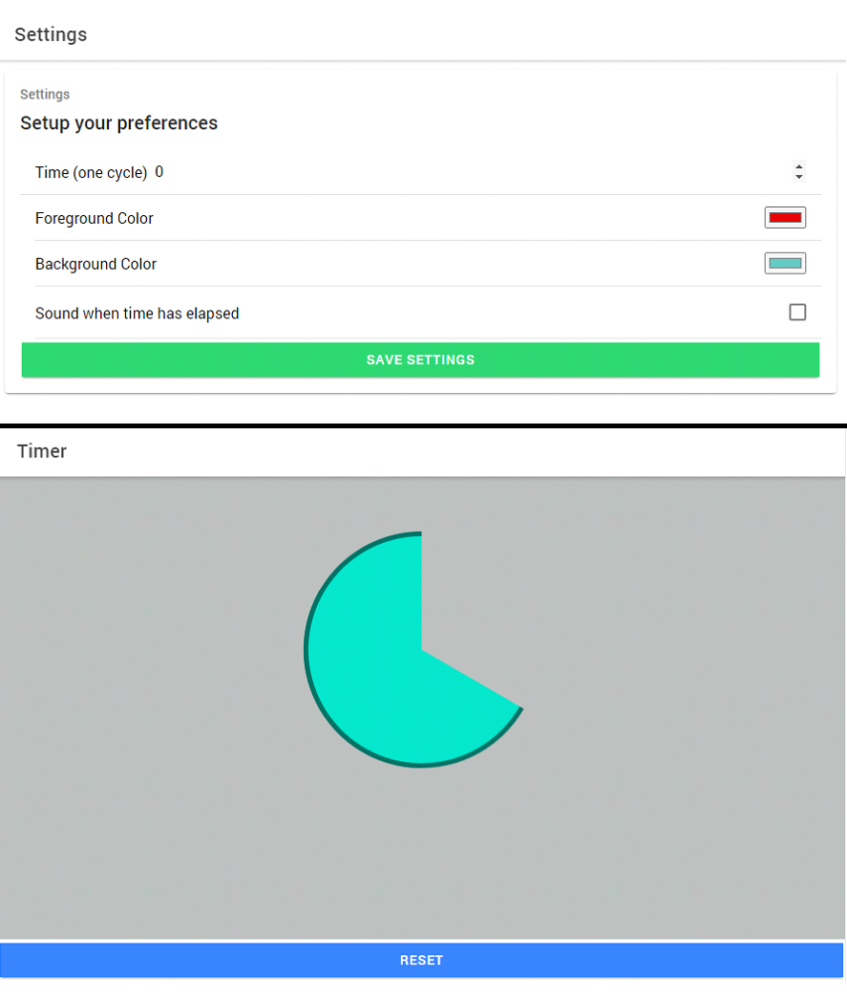

# Cross Development - Ionic
## Intro
Als we Ionic gebruiken om te cross-compileren, moeten we eerst de testcase omzetten naar een webtaal. Aangezien ik voor QT de testapplicatie van de docent mocht gebruiken, herschrijf ik nu deze applicatie in Angular. Angular (dat gebaseerd is op typescript) heeft een heel andere syntax dan C. Daarom kunnen we jammer genoeg weinig code hergebruiken. 

## Gevolgde stappen
### 1. Applicatie herschrijven naar Angular
Eerst gaan we Ionic installeren op onze computer. Typ volgend commando in:
> npm install -g ionic

Daarna gaan we een nieuw Ionic project aanmaken. Kies eerst je framework, wij kiezen hier voor Angular. Daarna kan je een starter template kiezen.

> ionic start projectTimer

Kies een editor om je project mee te openen, en probeer het project te runnen. Zorg ervoor dat je in de juiste map zit.

> ionic serve

Nu herschrijven we alle code in Typescript, zodat we een webapplicatie krijgen. Aan de hand van de Ionic documentatie (onderdeel Angular) kan je heel wat informatie terugvinden over de routing, de modules,... En via de UI Components documentatie vind je makkelijk terug welke ionic tags je best gebruikt. 

Handige documentatie over het Ionic framework:
* https://ionicframework.com/docs/angular/navigation
* https://ionicframework.com/docs/components 

Via de localhost kunnen we ons project bekijken.

### 2. Capacitor
Nu gaan we over de stappen die nodig zijn om de Ionic App te testen in een Android Emulator. We maken gebruik van Capacitor, dat gereleased is in april 2020. Capacitor is een native runtime voor hybride applicaties. Een hybride app is een webapp die we via een wrapper op andere platformen kunnen gebruiken, zoals Android of iOS. Wij gebruiken dus Capacitor als 'wrapper', aangezien dit ook door Ionic ontwikkeld is.

Wij gaan de applicatie runnen op een Android smartphone. Zorg ervoor dat Android Studio geïnstalleerd is op je computer. Zo hebben we toegang tot het build systeem Gradle, de juiste SDK en een geschikt Android Virtual Device.

### 3. Plugins toevoegen 
Capacitor maakt gebruik van plugins zodat de applicatie toegang heeft tot de native API. Zo kunnen we toegang krijgen tot het systeem, de camera, storage,... Capacitor heeft zelf een hele lijst van officiële plugins, die kan je terugvinden via volgende link: https://capacitorjs.com/docs/apis . Je kan ook zelf een custom plugin schrijven.

Voor de Timer Applicatie heb ik gebruik gemaakt van de plugin Modals, om een alert te tonen wanneer de timer is afgelopen.
Om de kleuren van de cirkel op te slaan, gebruik ik de plugin Storage. Zo blijven de gekozen kleuren behouden, ook na het afsluiten van de applicatie.

### 4. Plugins testen
Onze applicatie heeft nu alle nodige functionaliteiten, het is tijd om deze te testen in een emulator. Volg hiervoor volgende stappen:

#### 4.1 Installeer de dependancy
> npm install -g @ionic/cli native-run cordova-res

#### 4.2 Voeg een @capacitor map toe
Kijk na of je een @capacitor map hebt staan in je node_modules map. Indien dit niet het geval is, voeg deze dan toe via volgend commando:
> ionic integrations enable capacitor

#### 4.3 Build de applicatie
> ionic build

#### 4.4 Start de live reload sessie op
> ionic cap run android -l --external

Selecteer een IP adres in de lijst. Android wordt nu opgestart, dit kan een vijftal minuutjes duren.

    Error: This version of Android Studio cannot open this project, please retry with Android Studio 3.6 or newer
    Betekenis: Update je Android Studio
    Oplossing: Controleer de updates in Android Studio, en voer deze uit. Build daarna opnieuw de applicatie.

#### 4.5 Bewerk de Androind Manifest file
De development server waar we onze app op runnen, gebruikt geen https maar http. Hierdoor wordt die door Android (vanaf API level 28 of hoger) als onveilig gezien, en moeten we dit specifiek toelaten in het manifest. Pas volgende code aan:
> <application android:usesCleartextTraffic="true"

Nu kan je de applicatie runnen op een Android emulator, en alle functionaliteiten testen.

    Error: io.ionic.starter E/Capacitor: Unable to read file at path public/plugins.
    Betekenis: Het path naar public/plugins kan niet gelezen worden.
    Oplossing: Download en update API 27.

Probeer de applicatie opnieuw te runnen.

    Error: Installation did not succeed. The application could not be installed. 
    Betekenis: De installatie is niet gelukt.
    Oplossing: Installeer en update volgende SDK Tools: Android SDK Build-Tools, Android Emulator, Android SDK Platform-Tools en Android SDK Tools. 

Run de applicatie opnieuw, deze keer zou het moeten werken.

### 5 Deployment
Nu we de applicatie getest hebben, kunnen we deze gaan deployen. Open opnieuw de manifest file in Android Studio, en zet usesCleartextTraffic op false.
> <application android:usesCleartextTraffic="false"

Build daarna opnieuw je ionic applicatie. en kopieer deze op de juiste plaats.
> ionic build

Wanneer de webcode gebuild is, moeten we het kopiëren naar een native project. Elke keer als je iets in je code hebt veranderd en hebt gebuild, moet je dit commando uitvoeren.
> ionic cap copy

Open daarna Android Studio via volgend commando:
> ionic cap run android

Nu kunnen we onze applicatie runnen, en hebben we een hybride app ontwikkeld!

## Veranderingen in de code
Aangezien we de code van C naar Angular (Typescript) omzetten, kunnen we weinig code hergebruiken. De belangrijkste verandering is het tekenen van de cirkel. Bij het tekenen van de cirkel, waar we visueel de tijd zien passeren, gebruikten we in C het paintEvent. Daar werkten we met coördinaten en functies zoals setBrush en drawRect. In Angular heb ik besloten om de cirkel te tekenen via css en css animaties. Aangezien ik al wat ervaring heb met css animaties, was dit voor mij de meest logische keuze. Ik heb 3 halve cirkels gebruikt, via de visibility de cirkels (on)zichtbaar gemaakt, en ze dan geanimeerd met keyframes. Het eindresultaat is uiteindelijk hetzelfde als in C. 

## Link met theorieles
TODO OOOOOOOOOOOOOOOOOOOOOOOOOOO
(vb: welk is het build systeem van mxe of uw qt-testcase, Hoe secure is uw Electron applicatie, ...)

## Conclusie
goede documentatie vna ionic

ondanks dat capacitor heel nieuw is, ook voldoende documentatie over te vinden

aangenaam om mee te werken, aangezien ik vertrouwd ben met webtalen.

## Screenshots eindresultaat

## Extra's 
### Gebruikte sites:
https://ionicframework.com/docs/angular/navigation

https://ionicframework.com/docs/components

https://www.w3schools.com/css/css3_animations.asp

https://developer.android.com/studio/intro/update

https://capacitorjs.com/docs/apis 
